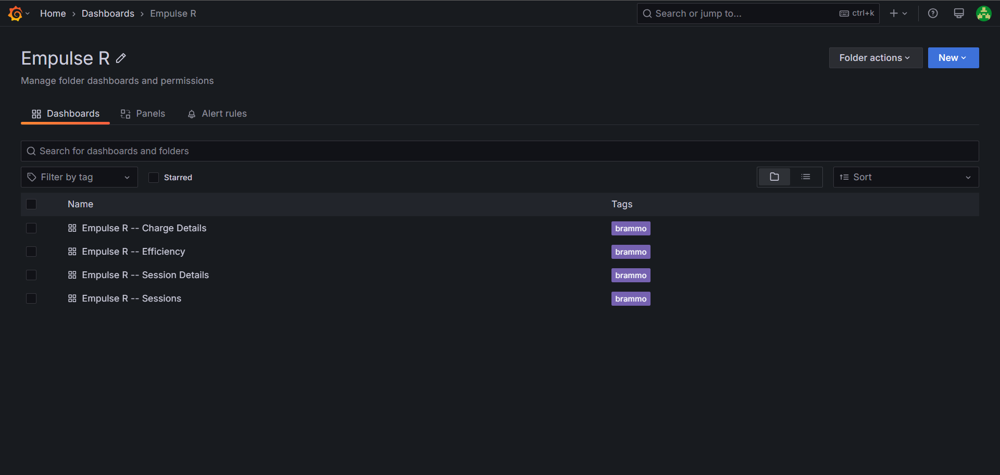
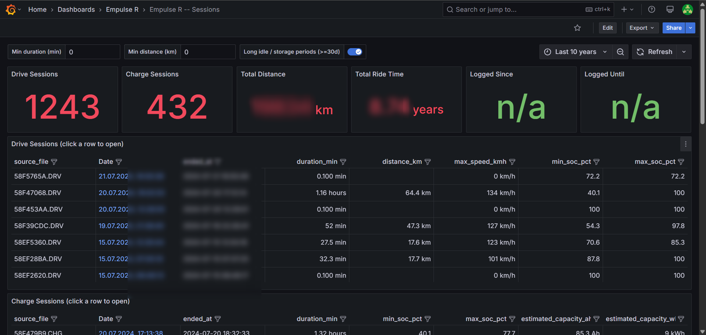
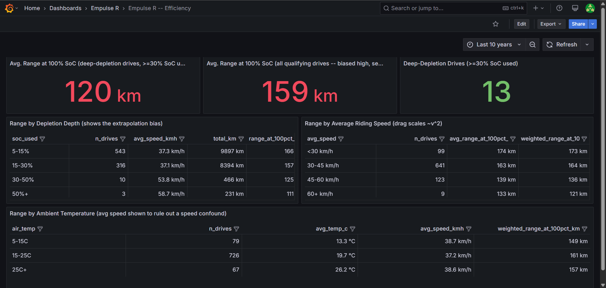
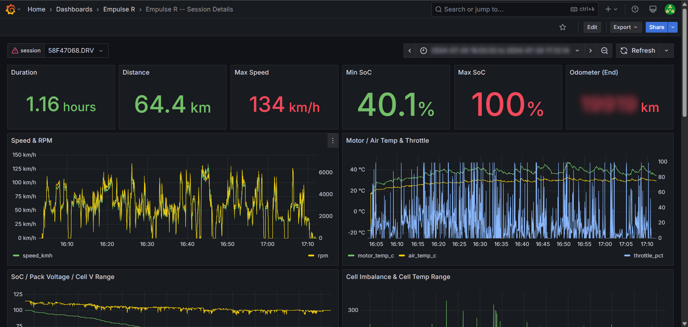
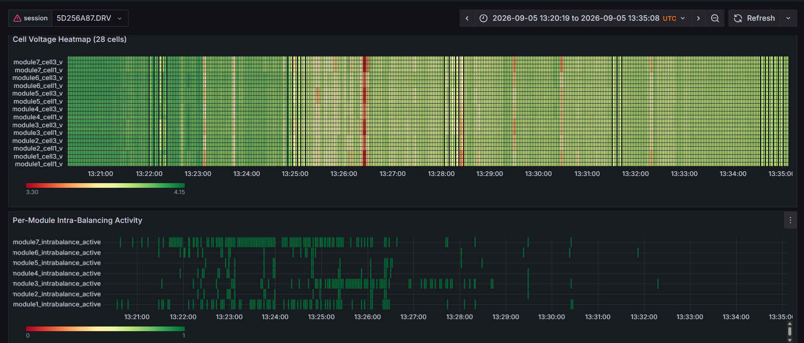
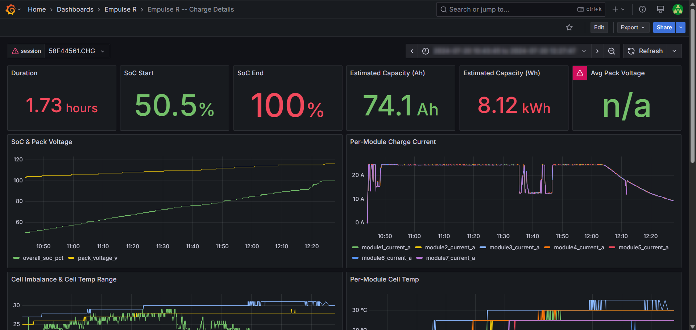

# Empulse Telemetry

A little data pipeline and dashboard set for a 2014 Brammo Empulse R electric motorcycle: decode
the bike's own `.DRV`/`.CHG` log files, load ~11.7M telemetry rows into TimescaleDB, and explore
battery health, range, and efficiency in Grafana.

The bike logs every drive and every charge to a USB flash drive under the seat (Brammo's "DDC"
system) in a compact binary format. `decode_empulse_logs.py` turns that into plain CSV; the rest
of this repo gets it into a real database with dashboards on top.

Setup, the file layout, and the full data model are in **[INSTALL.md](INSTALL.md)**.

## Grafana dashboards

All under an "Empulse R" folder, tagged `brammo`:

- **Sessions** -- overview of every drive/charge session (clickable tables linking into the detail dashboards below), pack capacity degradation over time, module SoC spread trend, end-of-charge cell imbalance trend

  

- **Efficiency** -- real-world range at 100% SoC, broken down by how much of the pack a drive actually used, average riding speed, and ambient temperature

  

- **Session Details** -- per-drive deep dive: speed/RPM, motor/air temp, SoC & pack voltage, per-module current/temp/SoC, cell voltage heatmap, kickstand state

  

  Cell voltage heatmap (fixed 3.30V-4.15V color scale) alongside per-module intra-balancing
  activity for the same session:

  

- **Charge Details** -- per-charge deep dive: SoC & pack voltage, per-module charge current/temp, cell voltage heatmap, cell imbalance

  

## Getting started

See **[INSTALL.md](INSTALL.md)** for running it with Docker Compose or on Kubernetes.
